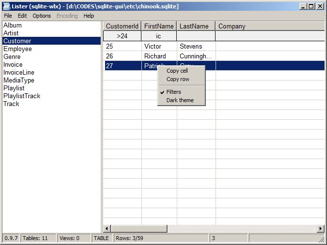

**sqlite-wlx** is a [Total Commander](https://www.ghisler.com/) plugin to view SQLite3 files.

|[**Download the latest version**](https://github.com/little-brother/sqlite-wlx/releases/latest)|
|-------------------------------------------------------------------------------------------|



### Features
* Column filters
* Sort data by column click
* Doesn't require SQLite library (built-in)
* Supports huge tables

### Filters
* Use ABC as a column filter to find rows containing "ABC"
* Use =ABC to find rows with column values equal to "ABC"
* Use !ABC to find rows without "ABC"
* Use >N or <N to find rows with more or less N

### How to build
```
set "dir=%cd%"
echo %dir%

rem 32bit, mingw64
pushd c:\mingw64\mingw32\bin
c:\mingw64\mingw32\bin\i686-w64-mingw32-gcc.exe -Wl,--kill-at -shared -static %dir%/main.c %dir%/include/sqlite3.c -o %dir%/sqlite-wlx.wlx -m32 -s -Os -lgdi32 -lcomctl32 -DSQLITE_OMIT_DEPRECATED -DSQLITE_OMIT_SHARED_CACHE -DSQLITE_ENABLE_JSON1

rem 64bit, mingw64
pushd c:\mingw64\mingw64\bin
c:\mingw64\mingw64\bin\x86_64-w64-mingw32-gcc.exe -shared -static %dir%/main.c %dir%/include/sqlite3.c -o %dir%/sqlite-wlx.wlx64 -m64 -s -Os -lgdi32 -lcomctl32 -DSQLITE_OMIT_DEPRECATED -DSQLITE_OMIT_SHARED_CACHE -DSQLITE_ENABLE_JSON1
```

